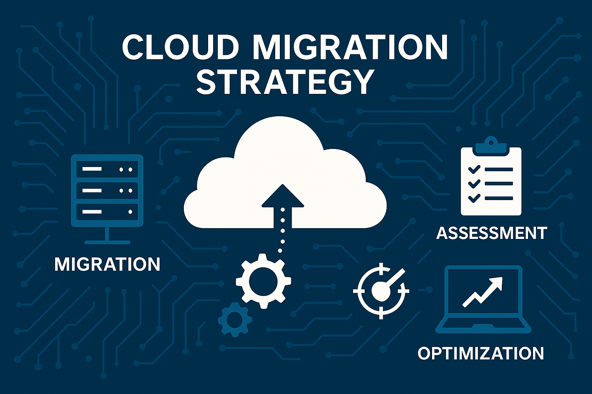

+++
date = '2025-06-08T14:49:58-04:00'
title = 'Best Practices for Cloud Migration '
+++

# summary
Best Practices for Cloud Migration refers to the strategic guidelines and methodologies that organizations should adopt when transitioning their data, applications, and infrastructure to cloud computing environments. As more businesses seek to leverage the scalability, flexibility, and cost-efficiency of cloud services, understanding the nuances of effective migration becomes increasingly critical. Notably, a well-executed migration can significantly enhance operational performance, whereas poor planning can result in costly downtime and data loss, making it a pivotal aspect of modern IT strategy. Cloud migration involves several key phases, including assessing current infrastructure, establishing migration goals, selecting appropriate strategies (such as rehosting, replatforming, or refactoring), and ensuring compliance with regulatory standards. Organizations are encouraged to conduct thorough assessments of their existing systems and identify application dependencies to mitigate risks associated with unexpected outages or compatibility issues during the transition process. Moreover, an emphasis on cost management is crucial, as unanticipated expenses can arise if resource needs are not accurately predicted or monitored.

Prominent controversies surrounding cloud migration include concerns about data security and privacy, particularly given the potential for breaches when sensitive information is transferred to cloud environments. Additionally, the challenge of maintaining compliance with regulations such as GDPR and HIPAA adds complexity to the migration process, requiring organizations to implement robust governance frameworks to safeguard data integrity and availability

Furthermore, managing stakeholder expectations and fostering employee buy-in are vital for overcoming resistance to change, as successful migration relies heavily on the cooperation and adaptability of the workforce

In summary, best practices for cloud migration encompass comprehensive planning, clear goal-setting, effective resource management, and ongoing monitoring to ensure that organizations can harness the full benefits of cloud technology while mitigating associated risks. By adhering to these principles, businesses can achieve a smoother transition and optimize their cloud environments for long-term success.

# Planning for Cloud Migration
Planning for cloud migration is a critical step that ensures a smooth transition of an organization’s data, applications, and infrastructure to cloud environments. A well-defined cloud migration strategy involves several key components, including careful assessment, resource allocation, and strategic alignment with business objectives.

## Cloud Migration Strategy
A cloud migration strategy is a comprehensive plan that outlines the necessary processes for an organization to move its assets to the cloud. It includes considerations for assessing the current IT infrastructure, understanding the costs involved, and determining the timeline for migration. Successful migration requires an evaluation of both short and long-term costs associated with cloud operations, which include migration fees, ongoing service costs, and potential savings on infrastructure and staffing.

## Infrastructure Assessment
Before proceeding with migration, it is essential to conduct a thorough assessment of the current infrastructure. This includes creating an inventory of IT assets, mapping dependencies between applications and services, and evaluating network capabilities to support migration efforts. Properly assessing infrastructure not only identifies potential compatibility issues but also highlights areas that may need reconfiguration to align with cloud environments[6]

## Application Dependencies
Identifying and understanding application dependencies is crucial for a successful migration. Overlooked dependencies can lead to migration failures, unexpected outages, and loss of functionality .Therefore, organizations should map out how applications interact with one another and with the underlying infrastructure, using both automated tools and manual verification methods .This helps ensure that all components are compatible with the cloud environment and can operate smoothly post-migration.

## Cost Management
Establishing a cost management strategy is vital in planning for cloud migration. Organizations should accurately estimate their usage requirements and understand the pricing structures of different cloud service providers to avoid hidden costs .By implementing cloud cost management tools and leveraging options such as reserved instances, businesses can optimize their resource allocation and control expenses effectively.

## Continuous Monitoring and Optimization
Once the migration is underway, continuous monitoring of cloud services is essential. Organizations should implement real-time monitoring and alerting mechanisms to maintain application reliability and performance during and after migration.This ongoing assessment not only helps in identifying issues promptly but also supports optimization efforts to enhance performance and reduce costs over time.By thoroughly planning and following best practices for cloud migration, organizations can ensure a successful transition to the cloud, aligning their IT infrastructure with their long-term business goals while maximizing the benefits of cloud computing.

# Migration Strategy
A well-defined migration strategy is crucial for ensuring a successful transition to the cloud. Companies should carefully consider various migration approaches tailored to their specific needs and workloads. The following outlines key components and considerations for an effective migration strategy.

## Defining Migration Goals
Establishing clear goals and objectives for the migration is the first step. This includes defining timelines, budgets, and resource allocations to streamline the entire process .It's essential to identify the critical applications and workloads that will be migrated, as well as their interdependencies, to avoid complications during the migration.

## Migration Patterns and Approaches 
There are several migration strategies that organizations can adopt, each with its advantages and disadvantages:

### Rehosting (Lift and Shift)
Rehosting, commonly referred to as "lift and shift," involves moving applications and data to the cloud with minimal modifications. This strategy is often the fastest and simplest, making it ideal for companies looking for a quick migration without significant investment in changes to the applications. However, while it can provide immediate benefits, rehosting may not fully leverage cloud capabilities.

### Replatforming
Replatforming involves making minor changes to the application codebase before migrating to the cloud. This strategy, sometimes called "move and improve," balances speed with some level of optimization, allowing organizations to benefit from cloud capabilities while not requiring extensive rewrites.

### Refactoring
Refactoring, or "rip and replace," is a more comprehensive migration strategy that involves restructuring applications and potentially redesigning data architectures. Although this approach is labor-intensive and time-consuming, it often results in better cloud optimization and enhanced performance. It is typically used for applications that require significant enhancements or are not suitable for simple rehosting.

### Repurchasing and Retiring
In some cases, enterprises may choose to replace existing applications with cloud-based software-as-a-service (SaaS) solutions or retire legacy systems altogether. This strategy can streamline operations but requires careful evaluation of the existing system’s functionality versus the new solution’s capabilities.

### Retaining and Relocating
Certain applications may not be immediately migrated and can be retained on-premises while considering future migration options. Alternatively, relocating involves converting existing virtual machines to cloud instances, particularly effective for virtualized workloads needing cloud benefits like elasticity.

### Migration Planning and Execution
An effective migration plan should include detailed documentation of the migration process, including technical designs, roles and responsibilities, and risk management strategies. This blueprint should also outline rollback plans and disaster recovery steps to mitigate risks associated with migration disruptions.

### Continuous Monitoring and Adaptation
Throughout the migration process, organizations should monitor key performance indicators (KPIs) such as downtime thresholds and performance benchmarks. This real-time feedback allows for timely adjustments to the migration strategy, ensuring that potential issues are addressed promptly.

# Data Management
Effective data management is crucial for organizations considering cloud migration. It encompasses a range of practices and policies that ensure the quality, security, and regulatory compliance of data throughout its lifecycle. Key components of data management during cloud migration include data governance, data quality, data security, and regulatory compliance.

## Data Governance
Data governance is fundamental to defining who has access to data and how it is protected. It plays a vital role in maintaining control over data, particularly in a cloud environment where access can be ubiquitous.A well-defined data governance strategy helps maintain a data catalog that provides essential information about data sources, ownership, and usage. This is particularly beneficial during migration, as it tracks which data sets have been transferred and validates successful transfers.Furthermore, effective governance minimizes redundancy and ensures data consistency, which simplifies the migration process and reduces compatibility issues.

## Data Quality
High data quality is essential for successful cloud migration. Data governance procedures establish processes for data validation, cleaning, and enrichment, which contribute to improved data quality.Organizations must implement data validation and verification processes to maintain data integrity and ensure that the migrated data is accurate and reliable.Regular audits and data cleaning are recommended practices to eliminate inaccuracies that could hinder migration efforts.

## Regulatory Compliance
Compliance with regulatory standards is a critical aspect of data management, especially in industries with strict regulations like healthcare and finance. Organizations must establish policies that align with regulations such as GDPR and HIPAA to avoid potential penalties during the migration process. This involves assessing current data situations, understanding compliance regimes, and ensuring that data controls adhere to the requirements set by regulatory bodies.

## Security and Privacy
Implementing robust data security measures is essential during cloud migration. This includes classifying and categorizing data based on its sensitivity, which helps apply appropriate security controls. Establishing strict access controls and permissions ensures that only authorized personnel can access sensitive data. Role-based access controls (RBAC) and continuous monitoring of data activities are also recommended to prevent unauthorized access and data breachesAdditionally, organizations should remediate excessive access to sensitive data prior to migration, as overexposure can lead to significant security risks.

# Application Migration
Application migration is a critical component of cloud migration strategies that involves moving applications from on-premises or other cloud environments to a target cloud platform. To achieve a successful migration, organizations should adhere to a structured approach that includes planning, execution, and optimization.

## Migration Planning
Before initiating the migration process, a comprehensive assessment of the current application landscape is necessary. This involves creating a catalog of workloads, mapping them to infrastructure components, and identifying dependencies among applications. Understanding the specific requirements and constraints is essential for developing a detailed migration plan that minimizes risks and ensures a smooth transition.
#### Grouping Workloads: 
Applications and data should be migrated in manageable batches or waves, often referred to as sprints. This helps to maintain control over the migration process and allows for thorough testing and validation at each stage.
#### Technical Documentation:
Producing a technical design document, along with a RACI matrix, helps clarify roles and responsibilities throughout the migration process.

## Migration Strategies
Different applications require different migration strategies based on their architecture and business value. Common approaches include rehosting (lift-and-shift), refactoring, replatforming, and replacing applications.Each of these strategies entails various levels of complexity and resource requirements, so it is important to assess which method aligns best with the organization's goals.

## Incremental Migration Approach
An incremental migration approach is often recommended over a "big bang" migration, as it allows organizations to migrate applications in stages, reducing the risk of significant service disruptions. This method facilitates the isolation and resolution of potential issues, ensuring better service availability throughout the migration.Automated tools can assist in testing and verifying the migrated environment before cutover, helping to identify and address any issues early in the process.

## Dependency Management
One of the most common pitfalls in application migration is overlooking dependencies between services and components. To mitigate this risk, organizations should use automated tools to map and visualize application dependencies, creating visual dependency graphs that highlight interconnections. Understanding these dependencies is essential for planning complex migrations and avoiding unexpected outages.

## Post-Migration Optimization
After migrating applications to the cloud, organizations should focus on optimizing their cloud environment for performance, security, and cost efficiency. This includes setting up monitoring systems to track key metrics such as availability, latency, and resource utilization. Regular optimization reviews can help identify further opportunities for improvement and ensure that the organization fully realizes the benefits of its cloud investment. By following these best practices for application migration, organizations can navigate the complexities of moving to the cloud and enhance their operational efficiency while minimizing risks.

## Training and Change Management
Effective training and change management are essential components for organizations transitioning to the cloud. These strategies help to ensure a smooth migration process, minimize resistance to change, and empower employees to adapt to new technologies and workflows.

## Change Management Strategies
Implementing robust change management strategies can significantly reduce resistance and enhance the likelihood of a successful transition. Organizations should focus on understanding current resource utilization and workload patterns to avoid over-provisioning or under-provisioning cloud resources, which could negatively impact budget and operational efficiency.Additionally, it is essential to conduct assessments and create detailed roadmaps that outline the migration process, ensuring that all aspects of the migration are well-planned and executed.

## Importance of Involving Stakeholders
Engaging stakeholders early in the planning process is crucial. This includes everyone from executive sponsors to end-users, which helps align goals and set clear expectations .Their involvement fosters buy-in, which is vital for navigating the changes associated with cloud migration effectively. Maintaining open lines of communication throughout the migration journey, with regular updates regarding progress and challenges, is also important for managing expectations and maintaining trust.

## Comprehensive Training Programs
To prepare employees for the transition, organizations should invest in comprehensive training initiatives that address identified skill gaps. Training should be tailored for both IT staff and end-users, covering new tools, security practices, and troubleshooting procedures. Hands-on training sessions, simulations, and support networks such as mentorship programs can provide practical experience and ongoing guidance, facilitating smoother adaptation to the new cloud environment.

## Continuous Support Structures
Establishing support mechanisms is crucial for assisting employees during and after the migration process. This can include help desks, user manuals, and frequently asked questions (FAQ) sessions to address common concerns and challenges. A collaborative learning environment not only helps in skill development but also fosters a sense of community, making employees feel supported as they navigate the complexities of the migration.

## Continuous Improvement and Monitoring
Post-migration, organizations should prioritize continuous monitoring and optimization of their cloud environment. This includes evaluating performance metrics and implementing analytics tools for real-time visibility into cloud infrastructure. By regularly assessing and optimizing their systems, organizations can ensure that they are making the most of their cloud investments and continuously improving their operational efficiency.

# Post-Migration Considerations
Post-migration, organizations must adopt several best practices to ensure the effective operation of their cloud infrastructure and applications. This phase is critical to realizing the benefits of migration and involves ongoing performance monitoring, optimization, and security compliance.

## Continuous Monitoring and Performance Optimization
Organizations should implement robust monitoring strategies to keep track of system performance in real-time, focusing on workload patterns and identifying potential bottlenecks early on. By combining usage data with resource utilization metrics, businesses can optimize costs and ensure efficient resource allocation. Monitoring tools should provide insights across the entire stack, encompassing applications, infrastructure, and services, allowing teams to respond promptly to performance issues .Additionally, continuous optimization of cloud applications and infrastructure is essential. This involves analyzing key performance indicators (KPIs), such as application response times and resource utilization, to detect and rectify performance issues. Regular assessments help teams fine-tune configurations, optimize database queries, and leverage caching mechanisms, all aimed at enhancing user experience and operational efficiency.

## Security and Compliance
Security measures must be strengthened post-migration to protect cloud infrastructure and applications. Regularly patching software, implementing strong access controls, and ensuring data encryption in transit and at rest are fundamental practices .Organizations should also maintain comprehensive logging and auditing practices to track changes and user access, facilitating troubleshooting and compliance with industry regulations.

Compliance with regulatory standards is another critical aspect that organizations need to prioritize. Failing to meet compliance requirements can result in severe risks, including data breaches and reputational damage .Therefore, conducting a thorough risk assessment to identify potential cybersecurity threats is essential for robust business continuity planning.

## Capacity Planning and Resource Management
Effective capacity planning is necessary to prevent over-provisioning or under-provisioning of resources, which can lead to increased costs and operational inefficiencies. Organizations should periodically review their capacity needs and forecast future growth based on current usage patterns. This proactive approach helps in scaling resources appropriately, ensuring that infrastructure capabilities align with business demands.

## Stakeholder Engagement and Goal Alignment
Finally, it is crucial for organizations to engage stakeholders and align migration goals with broader business objectives. Establishing clear KPIs and performance expectations aids in making data-driven decisions and prioritizing tasks effectively. Regularly reviewing these metrics allows teams to identify areas for improvement and optimize processes for ongoing success.By adhering to these post-migration considerations, organizations can enhance the overall performance, scalability, and cost-efficiency of their cloud operations.

# Case Studies
## Use Cases and Best Practices
Various organizations have successfully implemented cloud migration strategies, highlighting critical use cases and best practices that can inform other businesses. For instance, a leading financial services company utilized a comprehensive list of workloads to identify specific requirements such as performance and scalability. By conducting proof of concepts (PoCs) and experiments, they validated each use case, ultimately leading to a significant reduction in scale-up times for CPU-bound workloads—up to 95% faster compared to their previous environment, thereby demonstrating immediate business value.

## Risk Management and Testing
A retail business faced substantial challenges post-migration when their inventory system failed to communicate with their customer database due to unforeseen compatibility issues. This situation emphasizes the importance of rigorous post-migration testing. Organizations that adopt comprehensive testing methodologies tend to experience 45% fewer post-migration issues, as evidenced by research from Forrester.By implementing a pre-migration baseline performance assessment and validating migration feasibility, businesses can better manage risks associated with migration processes.

## Stakeholder Engagement
Engaging stakeholders effectively can determine the success of a cloud migration initiative. In one case, an enterprise developed a robust communication plan to address stakeholder motivations and concerns regarding the migration. By outlining the personal and professional benefits of the change, they secured greater buy-in, which was crucial for a smooth transition.This highlights the significance of aligning stakeholder interests and maintaining transparent communication throughout the migration process.

## Incremental Migration Approach
An organization opting for a phased migration approach found it beneficial to start with non-critical applications. This strategy allowed them to learn from early migrations, refine their processes, and build confidence before tackling mission-critical systems. This incremental approach not only distributed resource requirements more evenly but also facilitated a smoother transition by enabling teams to demonstrate early successes to the wider organization.

## Handling Change Management
A university undertaking cloud migration had to navigate significant change management challenges, particularly concerning the interdependencies between various datasets and applications. By carefully planning which data to migrate first and managing these interdependencies, they mitigated the risk of data loss and ensured accessibility. The experience reinforced the necessity of thorough change management strategies in the face of operational and cultural shifts associated with cloud migration.
