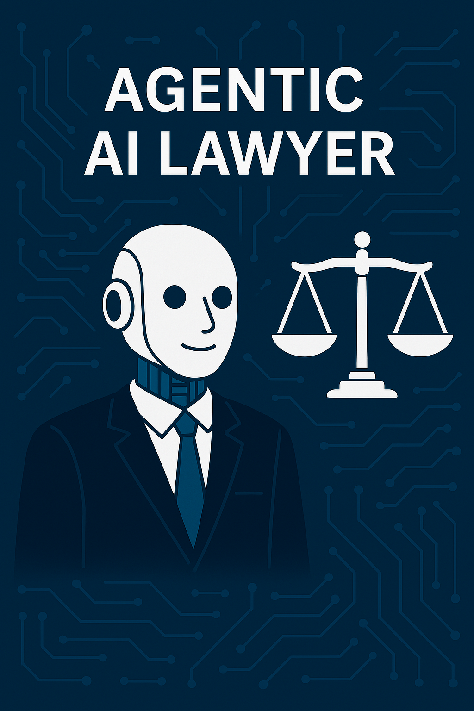

+++
date = '2025-06-08T15:33:01-04:00'
title = 'How Generative AI is changing the legal support system for common man'
+++

# summary
Generative AI is revolutionizing the legal support system by enhancing accessibility, efficiency, and personalization of legal services for the general public. This transformative technology, which utilizes large language models to understand and generate human-like text, has the potential to democratize access to legal information, making it easier for individuals—especially those from underserved communities—to navigate complex legal issues without the burden of costly consultations. As generative AI tools, including chatbots and document automation software, become more integrated into legal practice, they are poised to significantly reduce the traditional barriers to accessing justice, such as high fees and convoluted legal language.

Despite its promise, the adoption of generative AI in the legal sector is not without controversy. Legal professionals express concerns regarding the accuracy of AI-generated outputs, particularly when dealing with nuanced legal matters, leading to calls for stringent oversight and verification processes.

Issues surrounding client confidentiality and data security also pose significant challenges, as many lawyers remain hesitant to input sensitive information into AI systems due to fears of data breaches and compliance risks.

These concerns highlight the critical need for establishing robust ethical frameworks and governance practices as the legal community grapples with the implications of incorporating AI technologies into their workflows. As generative AI continues to evolve, its impact on the legal support system will likely expand, influencing everything from document management and legal research to client interaction and risk assessment. With an emphasis on improving access to justice, this technology holds the potential to empower individuals by providing immediate, context-specific legal guidance and support.

However, the legal field must navigate the inherent challenges of AI integration while maintaining the core principles of professional ethics and client confidentiality to ensure that the benefits of generative AI are realized equitably and responsibly.

# Historical Context
The integration of artificial intelligence (AI) into the legal support system marks a significant evolution in how legal services are delivered to the public. Traditionally, the legal field relied heavily on human expertise, with lawyers providing bespoke services based on their extensive knowledge of law and legal precedents. This model, while effective, often limited access to justice due to the high costs associated with legal representation and the complexity of legal language, which can alienate those without legal training.

With the advent of traditional AI systems, significant strides were made in automating repetitive tasks such as document review and data analysis, which enhanced efficiency within legal practices. These systems operated under predefined rules, facilitating tasks like case management and client interaction through user-friendly solutions, including chatbots designed to provide basic legal information

However, traditional AI fell short in providing personalized and nuanced legal assistance, as it was limited by its programming and could not adapt to the complex needs of individuals navigating the legal landscape[1]

The emergence of generative AI, particularly since the introduction of large language models (LLMs) like OpenAI's GPT-4, has transformed the potential for legal support systems. Generative AI systems possess the ability to understand and generate human-like text, allowing for more sophisticated interactions and the production of tailored legal advice based on specific user queries.

This advancement represents a paradigm shift in legal service delivery, as these systems can process vast amounts of legal data to generate relevant and applicable insights, thus democratizing access to legal information for the general public.

The shift toward generative AI has been accompanied by an increased focus on the need for AI literacy among legal professionals. As AI tools become more integrated into legal workflows, understanding their capabilities and limitations is crucial to harnessing their potential while ensuring compliance with professional ethics, particularly regarding client confidentiality and data security.

While generative AI promises to enhance access to justice and provide individuals with greater agency in understanding their legal rights, it also raises concerns about the potential for errors and the need for responsible usage of AI technologies.

# Mechanisms of Generative AI in Legal Support
Generative AI is transforming the legal support system by enhancing efficiency, accuracy, and accessibility in various legal processes. This technology offers a range of applications that benefit both legal professionals and clients.

## Document Management and Drafting
One of the primary uses of generative AI in legal support is in document management and drafting. AI tools can efficiently handle large volumes of legal documents, aiding in tasks such as contract review and legal drafting by automating repetitive processes. For instance, machine-learning drafting tools can compile preferred language from existing firm documents or external sources, resulting in improved efficiency and accuracy of legal documents, including briefs and contracts.Furthermore, AI can generate customized templates and automate citation processes, which streamlines document preparation and reduces labor costs.

## Legal Research and Analysis
Generative AI significantly enhances legal research capabilities. By utilizing advanced algorithms, it allows attorneys to quickly find relevant cases, precedents, and legal trends, thus expediting the research process. This automation not only saves time but also helps smaller firms access tools previously available only to larger firms, leveling the playing field in legal practice. Moreover, AI's ability to analyze historical data enables predictive analysis of litigation outcomes, assisting legal teams in strategizing effectively based on past case results[3]

 ## Client Interaction and Support
Another critical mechanism of generative AI in legal support is its role in improving client interactions. AI can provide immediate responses to common legal queries, enhancing client satisfaction and freeing lawyers to focus on more complex tasks. This capability not only makes legal services more accessible to the general public but also improves the overall efficiency of legal practices.

## Ensuring Compliance and Data Security
Generative AI also plays a vital role in ensuring compliance with evolving legal regulations. By automating compliance reviews and tracking important deadlines and obligations, AI reduces the risk of missed deadlines and enhances overall risk management. Additionally, the integration of AI in document review processes aids in the identification of relevant documents during e-discovery, thus minimizing the traditionally high costs associated with manual reviews[7]

## Addressing Challenges of AI Integration
While the potential of generative AI is substantial, its integration into the legal field is met with challenges. Lawyers often find it difficult to trust AI-generated outputs, particularly for complex legal issues that require nuanced judgment. Ensuring data privacy and client confidentiality is also a critical concern, as AI tools must be carefully monitored to avoid biases and protect sensitive information.

# Applications of Generative AI in Legal Support
Generative AI is transforming the landscape of legal support, providing innovative solutions that enhance accessibility, efficiency, and personalization in legal services. Its applications span various facets of legal practice, making it an invaluable tool for both legal professionals and the general public.

## Enhancing Access to Legal Information
One of the primary applications of generative AI is its ability to provide personalized legal information and guidance on a variety of issues, such as employment disputes, financial matters, and welfare eligibility. Chatbots and AI-powered platforms can offer immediate, context-specific advice, helping users understand their rights and options. This is particularly vital in the context of increasing legal issues related to employment, welfare, and benefits, as identified in the 2023 Legal Needs Survey.

## Document Automation and Drafting
Generative AI excels in automating document generation, allowing legal professionals to create standard legal documents such as contracts, briefs, and non-disclosure agreements with greater speed and accuracy. By utilizing established templates and identifying key clauses, these AI tools reduce human error and save time, enabling lawyers to focus on more complex legal matters. Additionally, they assist in drafting initial legal documents like complaint letters, providing users with actionable content tailored to their needs.

## Legal Research and Analysis
Another significant application of generative AI is in legal research. AI systems can swiftly analyze vast databases and case law to identify relevant precedents, enhancing the thoroughness and speed of research efforts. This capability not only improves the quality of legal work but also allows lawyers to provide more informed advice to clients by predicting likely case outcomes based on historical data.

## E-Discovery and Risk Management
Generative AI also plays a crucial role in e-discovery, where it helps to quickly sort through extensive documents to find critical information, thus minimizing manual labor and the risk of overlooking important data. Additionally, AI tools can assist in risk assessment and compliance by identifying potential risks in legal documents or transactions, allowing legal practitioners to prevent costly mistakes.

## Client Interaction and Communication
AI chatbots have emerged as valuable assets in client communication, handling routine inquiries, providing case updates, and scheduling meetings. This automation allows lawyers to allocate their time to higher-priority tasks, improving overall client service and satisfaction. By offering instant responses and multilingual support, AI tools empower underserved communities and enhance the client experience.

# Benefits of Generative AI in the Legal Sector
Generative AI is significantly transforming the legal sector by enhancing operational efficiency, improving access to justice, and streamlining various legal processes. Its applications range from automating routine tasks to providing personalized legal assistance, thus driving substantial benefits for both legal professionals and clients.

## Enhanced Efficiency and Accuracy
One of the most notable benefits of generative AI is its ability to automate time-consuming tasks, such as legal research and document drafting. Approximately 24% of law firms have started using generative AI for these purposes, which allows lawyers to focus on more complex legal issues and client interactions.This technology not only reduces manual labor but also minimizes the risk of errors, thereby increasing the overall accuracy of legal outputs. Many lawyers report feeling more efficient and capable of using their expertise more effectively when supported by AI-generated drafts.

## Improved Access to Justice
Generative AI also plays a crucial role in enhancing access to legal services, particularly for vulnerable populations, including low-income individuals and non-native speakers. AI-driven chatbots, like AccessAva, provide personalized legal guidance and resources, helping users navigate legal complexities without the need for expensive legal consultations. By offering immediate, context-specific advice, generative AI demystifies legal processes and empowers individuals to understand their rights and options.

## Streamlined Client Communication
AI technologies facilitate better communication between legal professionals and clients. AI chatbots can handle routine inquiries, provide updates on case statuses, and assist in scheduling, allowing lawyers to dedicate their time to higher-priority tasks. This shift not only improves client satisfaction but also helps lawyers manage their workloads more effectivel.

## Risk Assessment and Management
Generative AI contributes to risk assessment by analyzing legal documents and business transactions to identify potential issues. This capability helps lawyers mitigate risks before they escalate, preventing costly mistakes and enhancing the overall integrity of legal practices.

## Future Implications
As generative AI continues to evolve, its integration into the legal sector is expected to expand, further empowering legal professionals to work smarter and deliver enhanced value to clients. Law firms that strategically adopt AI technologies are likely to remain competitive in a rapidly changing legal landscape, enabling them to meet increasing client demands for efficiency and accuracy.

# Challenges and Limitations
The integration of generative AI into the legal support system presents several challenges and limitations that must be addressed to enhance access to justice effectively. While technology has the potential to improve legal service accessibility, its adoption is hindered by various barriers.

## Barriers to Adoption
Emerging technologies face numerous obstacles in the legal sector. A report on Technology, Access to Justice, and the Rule of Law identifies key barriers, including confusion surrounding current technologies, unequal resources, and challenges in digital and legal literacy. Insufficient funding and regulatory concerns further complicate the landscape.

Digital and data literacy are crucial for leveraging AI technologies; these literacies not only enable users to interact with AI systems but also allow them to understand their mechanisms, limitations, and biases. Additionally, the digital divide restricts access for individuals lacking reliable internet connections or digital skills, creating disparities in legal service accessibility. Therefore, an agile and adaptive innovation strategy that emphasizes user-centric approaches and incorporates insights from both legal and technical experts is essential for overcoming these challenges.

## Confidentiality and Security Concerns
One significant limitation of generative AI systems in the legal context is the concern over client confidentiality. A survey found that 79% of legal professionals believe that using generative AI for processing client data compromises the duty of confidentiality due to a lack of data protection guarantees.This concern is especially pronounced when AI systems are developed outside the European Union, where data protection standards may be less stringent. Moreover, compliance with existing legal frameworks poses challenges. Many lawyers are hesitant to enter client data into generative AI systems, citing transparency issues about data processing. In fact, 93% of respondents reported that they do not input their clients' confidential information into these systems. This reluctance reflects a broader anxiety regarding the integrity and security of client data.

## Limitations of AI Technologies
The effectiveness of generative AI is further limited by its inherent capabilities. Respondents noted that AI systems often produce inaccuracies, referred to as "hallucinations," which can mislead legal professionals when conducting research or drafting documents. Such inaccuracies necessitate rigorous verification of AI outputs by lawyers, underscoring the need for human oversight in legal processes. Additionally, the lack of context specificity in AI responses complicates the generation of relevant legal documents, especially in complex cases where nuanced understanding is crucial. Despite the potential benefits of generative AI in streamlining legal services, these challenges and limitations highlight the need for careful consideration of ethical, security, and practical implications as the legal profession navigates the integration of technology into its practices.

# Case Studies
## Applications of Generative AI in Legal Practice
Generative AI has begun to play a significant role in various aspects of legal practice, demonstrating its potential to enhance efficiency and improve access to legal support. One notable use case is the drafting and refinement of legal documents. Law firms have reported increased speed and quality in drafting contract clauses, with generative AI systems facilitating not just English but also foreign language documents such as those in French and German. These improvements extend to the translation of legal texts, enabling lawyers to communicate effectively across language barriers.

## Enhancements in Legal Research
Legal research is another area where generative AI is making substantial contributions. AI-powered research tools allow legal professionals to quickly identify leading case law and guiding legal principles to support their arguments. However, it is important to recognize that the technology is not without risks; generative AI systems can occasionally fabricate case citations or misrepresent the law, which underscores the need for lawyers to maintain oversight over the outputs generated by these systems. As such, while AI tools enhance efficiency, they also necessitate a careful examination of their results to ensure accuracy and reliability.

## Improving Access to Justice
Generative AI has the potential to address some barriers to accessing justice, particularly for vulnerable populations. According to the 2023 survey highlighted in the Legal Needs of Individuals in England and Wales report, two-thirds of adults have faced legal issues, yet only 62% received any form of help. By implementing AI solutions that provide multilingual legal resources and community outreach, legal professionals can better engage with these populations, thereby improving their understanding of rights and responsibilities.

## Training and Development Initiatives
To maximize the potential of generative AI in legal practice, training programs for legal professionals are being developed. These courses aim to enhance both the theoretical and practical understanding of AI tools, focusing on their efficiencies and limitations, as well as the implications for professional conduct rules. Such initiatives will ensure that lawyers are equipped with the knowledge to leverage AI responsibly and effectively in their work, thereby fostering a legal environment that embraces innovation while upholding ethical standards.

## Future Prospects
The integration of generative AI into legal practice is expected to continue evolving. Legal tech companies and law firms recognize that while AI can significantly enhance efficiency, it cannot replace the critical thinking and contextual understanding required in legal reasoning. As generative AI systems improve, they are likely to become even more reliable and accurate, thereby contributing further to the efficiency of legal processes and enhancing access to justice for all individuals. The emphasis remains on balancing innovation with the fundamental principles of legal ethics and client confidentiality, ensuring that technology serves as a valuable tool rather than a replacement for human judgment.

# Future Trends
The landscape of the legal support system is poised for significant transformation as generative AI continues to evolve and integrate into legal practices. Key future trends include the customization of AI models, enhanced access to justice, and a focus on compliance with ethical and legal standards.

## Customization of Generative AI Models
As businesses increasingly adopt generative AI, a Gartner survey predicts that by 2027, over 50% of generative AI models will be tailored to specific industries or business functions. This trend allows organizations to fine-tune AI capabilities according to their unique needs, which may lead to more effective legal support solutions. Smaller, domain-specific models are anticipated to emerge, reducing risks associated with inaccuracies, biases, and hallucinations in AI-generated content. Such advancements can enhance compliance with ethical considerations within the legal framework, ensuring that generative AI applications uphold legal standards and integrity.

## Enhanced Access to Justice
Generative AI holds the potential to significantly improve access to justice by addressing persistent barriers faced by individuals in navigating the legal system. With advanced natural language processing algorithms, generative AI can offer customized legal advice based on user queries, breaking down complexities and making legal information more accessible. By automating routine tasks and providing personalized interactions, AI technologies can help bridge the justice gap, especially for those facing financial constraints, legal complexities, or language barriers. This shift towards a more inclusive legal system can empower individuals to understand their rights and access necessary resources, promoting fairness in legal outcomes.

## Compliance with Ethical and Legal Standards
As generative AI technologies advance, legal professionals will need to navigate the associated risks, including copyright infringement and intellectual property concerns. There is a growing recognition of the need for strong governance frameworks to ensure that AI applications align with ethical guidelines and legal requirements. Continuous assessment and refinement of AI tools will be critical in mitigating risks and ensuring responsible use in legal contexts. This focus on compliance not only protects businesses from potential legal pitfalls but also enhances public trust in AI-driven legal services.