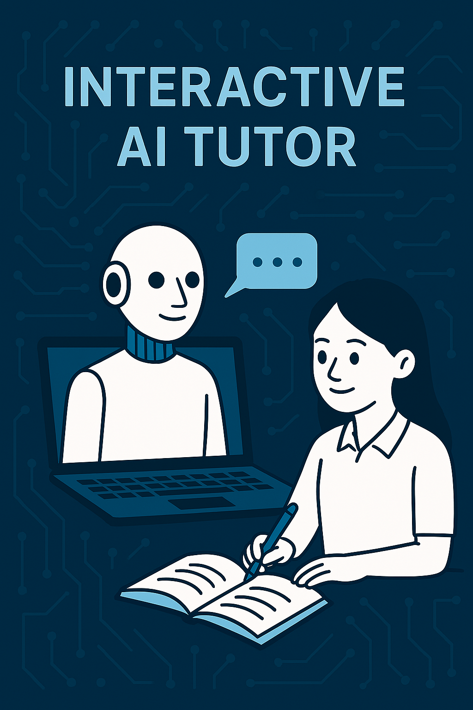

+++
date = '2025-06-08T14:56:49-04:00'
title = 'Interactive AI Tutor'
+++

.colored-heading {
  color:rgb(219, 52, 135); /* Light blue example */
}

# Summary{.colored-heading}
summary
Generative AI in Academic Writing refers to the use of advanced algorithms, such as ChatGPT, to enhance the writing skills of students within educational settings. This technology has garnered significant attention for its potential to revolutionize the writing process by facilitating efficient content creation, offering insights into effective communication, and providing personalized feedback. As educators increasingly incorporate generative AI tools into their curricula, the dialogue surrounding their benefits and ethical implications has become more prominent, prompting discussions about how to integrate these innovations responsibly into traditional pedagogical frameworks. The notable advantages of generative AI in academic writing include improved clarity, creativity, and productivity. Studies have shown that when students engage with AI-assisted writing tools under the guidance of instructors, they often experience enhanced writing proficiency and confidence.

 Instructors play a pivotal role in this process, as they are responsible for teaching students how to navigate the use of AI while upholding academic integrity and addressing concerns regarding overreliance on technology.

 Despite these benefits, the integration of generative AI in education also presents challenges. Key concerns include the potential for diminished critical thinking skills due to dependency on AI-generated content and the ethical complexities surrounding intellectual property rights associated with AI output.

 Furthermore, disparities in access to AI technologies may exacerbate existing inequalities among students, necessitating equitable solutions to ensure all learners benefit from these advancements in educational technology.

 As the educational landscape evolves, ongoing discussions about the balance between utilizing generative AI and maintaining rigorous academic standards remain crucial. Institutions are encouraged to establish comprehensive policies that promote responsible use while fostering an environment conducive to innovation and ethical practices in academic writing.

 By addressing both the opportunities and challenges presented by generative AI, educators can enhance student learning experiences and prepare them for future academic and professional endeavors.

# Generative AI in Education
Introduction to Generative AI in Academic Contexts
Generative AI refers to algorithms that utilize databases to identify patterns and generate content, which can encompass text, images, audio, and more. In academic settings, these tools serve as instruments that can enhance the writing process when employed responsibly. As educators increasingly integrate generative AI into learning frameworks, it is essential to recognize both its potential advantages and the challenges it poses.

## Benefits of Generative AI in Academic Writing
Generative AI tools, such as ChatGPT, can facilitate efficient content creation, saving time and providing clarity in writing. When utilized with good intentions, these tools can offer valuable insights into effective communication, ultimately improving students' writing skills. For example, they can assist in brainstorming ideas, drafting content, and refining language. Moreover, lecturers have noted that, when guided correctly, generative AI can act as a significant enhancer of students' creativity and writing proficiency.

## Role of Instructors in Guiding AI Use
Instructors play a critical role in guiding students on how to effectively leverage generative AI tools while maintaining academic integrity. As students express hopeful anticipation for AI support, it becomes crucial for educators to emphasize responsible use and the ethical implications of generative AI in their instruction. The necessity for human oversight is echoed by scholars who advocate for a balanced integration of traditional pedagogical approaches and technological innovations to uphold scholarly rigor and ethical standards.

## Challenges and Considerations
Despite the advantages, several challenges accompany the integration of generative AI in education. Concerns regarding overreliance on AI can impact the authenticity of student work and potentially diminish critical thinking skills. Furthermore, disparities in access to advanced AI tools may exacerbate existing inequalities in educational settings, necessitating efforts to ensure equitable opportunities for all students.Additionally, the ethical landscape surrounding intellectual property rights related to AI-generated content remains a complex issue that educational institutions must navigate.

# Role of Instructors in Academic Writing
Instructors play a crucial role in supporting students throughout the academic writing process. They facilitate a structured environment where writing is taught as a comprehensive process rather than as a mere product. This involves creating opportunities for students to draft, receive feedback from both peers and instructors, and revise their work. For high-stakes writing assignments, it is beneficial for instructors to scaffold writing prompts, allowing students to submit smaller pieces that culminate in a larger final product. Such scaffolding helps clarify the discipline's genre conventions and the specific jargon needed for effective writing, ultimately promoting students' familiarity with disciplinary expectations.

In the age of Generative AI, the role of instructors has evolved. While there may be hesitance regarding the integration of AI in writing courses, it is essential to recognize that writing remains a valuable pedagogical strategy that enhances cognitive processing and learning. Instructors are encouraged to embrace both traditional and technological approaches to academic writing. As noted by a lecturer, the mastery of academic writing involves an immersion in traditional methods, while AI can serve as an effective tool when used responsibly by students. Thus, instructors should emphasize the importance of student responsibility in leveraging AI tools as part of their writing journey, rather than relying on them as quick fixes.

Higher-stakes writing opportunities, such as academic research papers or journal articles, provide students with authentic learning experiences that mimic professional practices within their disciplines. These activities require sufficient time for brainstorming, drafting, receiving feedback, and revising, allowing students to cultivate their critical thinking skills and improve their writing proficiency.

Instructors are instrumental in guiding students through this process, providing timely and constructive feedback that helps to reinforce writing norms and disciplinary standards. As feedback is an essential component of learning, it is vital that instructors balance immediate feedback—which can sometimes lead to superficial understanding—with deeper engagement and critical reflection to foster meaningful learning experiences.

# Impact on Student Writing Skills
The integration of generative AI tools, such as ChatGPT, into academic writing has shown a positive impact on students' writing skills. A study involving first-year science and engineering students at an elite private university in India demonstrated that participants who had not previously used ChatGPT for writing improvement were able to enhance their writing abilities through targeted interventions utilizing the AI tool.

This indicates that generative AI can serve as an effective resource for students looking to develop their academic writing competencies.

## Students’ Perceptions and Attitudes
Students' perceptions of generative AI as a supportive resource in the writing process are generally favorable. Many view these tools as motivational aids that can guide them through the complexities of academic writing. As generative AI becomes more prevalent, understanding its potential role in writing skill development is crucial for both educators and students.

## Challenges Faced by Students
Despite the potential benefits, students often face significant challenges in academic writing, which include difficulties in reading comprehension, analytical skills, and basic writing mechanics such as grammar and structure.These obstacles can lead to poor grades, increased anxiety, and a decline in self-confidence. For instance, many students report feeling overwhelmed by complex assignments and are unsure about proper citation practices, making it essential to address these hurdles systematically.

## Strategies for Improvement
To navigate these challenges effectively, students are encouraged to adopt consistent writing routines and utilize AI tools like ChatGPT as part of their writing process. Engaging in daily writing exercises, seeking feedback from peers and instructors, and leveraging technology for editing and revising can significantly enhance their skills over time.Establishing a foundational understanding of writing mechanics, along with a commitment to continuous improvement, positions students for greater success in academic contexts.

# The Role of AI in Future Writing Challenges
Looking ahead, the incorporation of technology in academic writing presents both opportunities and challenges. While generative AI can streamline the writing process and provide valuable insights, it also raises concerns about the dilution of formal writing styles and the potential impact on students' grammar skills.

Therefore, it is vital for educators to guide students in using these tools responsibly, ensuring that they develop essential writing skills that will serve them well in their academic and professional futures.

# Future Perspectives
Integrating Generative AI in Academic Writing
As generative AI technologies, such as ChatGPT, continue to evolve, their integration into academic writing processes presents both opportunities and challenges. The potential for AI to enhance productivity and support the writing process is significant, yet it requires a careful balance between leveraging these tools and maintaining academic integrity. Educational institutions are encouraged to develop comprehensive policies that govern the use of AI in academic contexts to mitigate risks related to academic misconduct while fostering innovative teaching and learning practices.

## Empowering Educators and Students
To maximize the benefits of generative AI, educators must take an active role in guiding its use. This involves not only integrating AI tools into the curriculum but also fostering an understanding of ethical considerations associated with their application. By providing training and resources for both instructors and students, academic institutions can create an environment where generative AI serves as a collaborative partner in the writing process. Such an approach can enhance student engagement, promote critical thinking, and develop essential 21st-century skills necessary for future career success.

## A Focus on Ethical Practices
The future of academic writing in the context of generative AI hinges on a collective commitment to uphold the principles of academic integrity. This includes establishing classroom governance that promotes responsible use of AI tools and ensuring equitable access to technology for all students. Educators must emphasize a human-centered approach to learning that prioritizes student success and fosters an ethical framework for using AI, thereby reinforcing trust, accountability, and respect within the educational community[6]

## Research and Innovation
Ongoing research into the effectiveness and implications of using generative AI in education will be crucial. Future studies should focus on identifying strategies that educators employ to overcome barriers to technology integration and understanding how these tools can be optimized to support various learning styles and writing processes. Moreover, as AI technologies continue to advance, continuous evaluation and adaptation of educational policies will be necessary to keep pace with the changing landscape of academic writing and technology use.

